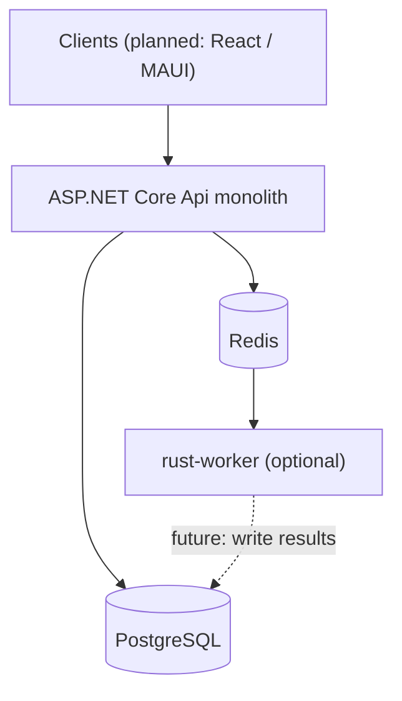
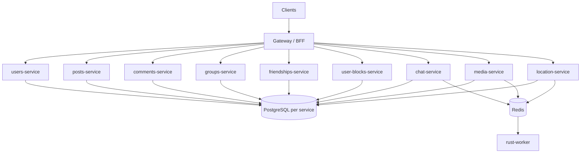

# Architecture

Tangle is a learning project that simulates a distributed system. Today it runs as a **modular monolith** with one optional background worker. The target is **domain-aligned microservices** (Phase 9) after Phases 5–7 complete: thin monitoring, React web client, and location in the monolith.

Service-layer conventions inside the monolith: [services/Api/AGENTS.md](../services/Api/AGENTS.md).

---

## Current state (as-built)

One ASP.NET Core deployable (`services/Api`) owns all business domains. PostgreSQL is the source of truth for every aggregate. Redis is optional (cache, SignalR backplane, pub/sub, Streams producer).



### In-process boundaries

Domains live under `services/Api/Domain/`. Each aggregate service owns one repository; cross-aggregate access goes through peer services, not foreign repositories. Orchestrators coordinate multi-step workflows without repositories.

This is **modular monolith** design — clear boundaries inside one process, one database schema (`AppDbContext`), one deployment unit.

### Async boundary

The only cross-process work path today:

```text
API (ChatMessageService) → Redis Stream XADD → rust-worker XREADGROUP → handler → XACK
```

See [QUEUE.md](../services/Api/Global/Queue/QUEUE.md) and [rust-worker README](../workers/rust-worker/README.md). The chat handler is currently a stub; worker infra (consumer group, retry, DLQ, replay) is implemented.

### Realtime

Chat uses SignalR (`/hubs/chat`) in-process. With Redis enabled, the SignalR backplane allows multiple API replicas. Client delivery is **not** pub/sub or Streams — see [REDIS.md](../services/Api/Global/REDIS.md) and [CHAT.md](../services/Api/Domain/Chat/CHAT.md).

### Docker Compose (default)

| Service | Role |
|---------|------|
| `api` | Monolith |
| `db` | PostgreSQL |
| `redis` | Cache, backplane, pub/sub, Streams |
| `rust-worker` | Optional (`--profile workers`) |

---

## Target state (MSA)

After Phase 9, the monolith decomposes into domain-aligned microservices behind a **gateway or BFF**. The gateway handles routing, JWT validation, and response composition — not domain business logic.



Service mapping detail: [SERVICE_BOUNDARIES.md](SERVICE_BOUNDARIES.md). Extraction plan: [MSA_MIGRATION.md](MSA_MIGRATION.md).

### Database strategy

**End goal:** database-per-service (each service owns its schema and migrations).

**Interim option (learning project):** shared PostgreSQL instance with **schema-per-service** before splitting physical databases. Avoid cross-schema FKs; use IDs and service calls/events instead.

### Rust worker

The worker stays a **separate process**, not a microservice per handler. Handlers grow by domain (`media.*`, `location.cluster`, etc.). Extract to a dedicated service only if CPU isolation or independent scaling demands it.

---

## Communication patterns

| Pattern | Use when | Today | Target |
|---------|----------|-------|--------|
| In-process service call | Same deployable, strong consistency | `PostService` → `UserService` | Replaced by HTTP/gRPC client |
| Sync HTTP / gRPC | Cross-service reads, auth checks, enrichment | N/A (monolith) | Primary sync boundary |
| Redis pub/sub | Fire-and-forget domain events | `IEventPublisher` | Cross-service notifications |
| Redis Streams | Durable async work | `IWorkQueue` → rust-worker | Same; may add Kafka later |
| SignalR | Client push (chat, location) | In-process hub | Owned by chat / location services |

Do **not** use Streams as the client realtime channel. SignalR (or WebSocket) delivers live updates; Streams handle background processing.

---

## Monorepo layout

```
/services
  /Api          ← monolith today; shrinks during Phase 9
/clients/web    ← planned React client (Phase 6); MAUI optional later
/workers
  /rust-worker  ← async job processor
/libs           ← planned shared contracts
/tools          ← planned Go CLI / load testing
/infra          ← planned Prometheus / Grafana
/docs           ← architecture and migration docs (this folder)
```

Solution file (`Tangle.slnx`) currently includes only `Api` and `Api.Tests`. Workers and infra are folders outside the .NET solution.

---

## What is not MSA today

- README diagram label "Gateway" is **aspirational** — there is no separate gateway service yet.
- No inter-service HTTP boundaries beyond API → Redis → worker.
- No distributed tracing (OpenTelemetry planned in Future Considerations).
- No service mesh.

These are intentional. The monolith keeps deploy-and-run simple while Phases 5–7 land; MSA extraction (Phase 9) starts only after that vertical slice works. See [README.md](../README.md#development-phases).
