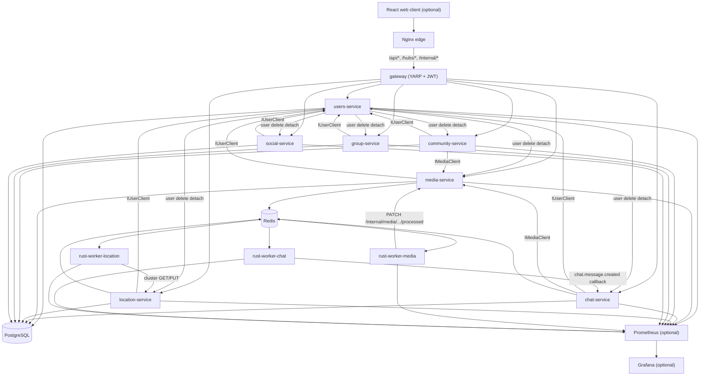
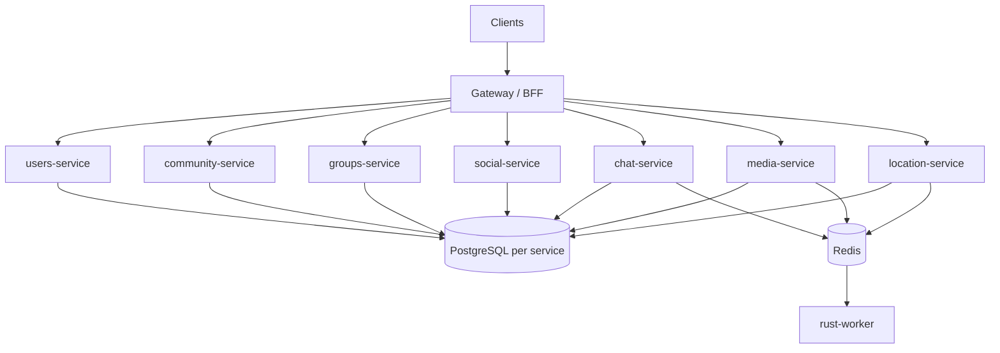

# Architecture

Tangle is a learning project that simulates a distributed system. Local Compose runs **users-service**, **gateway**, and extracted domain services (media, chat, location, community, group, social) behind an Nginx edge, optional Rust workers, optional React web client, and optional Prometheus/Grafana. Azure production CD still targets the removed monolith image until Bicep/parameters cutover — see [MSA_MIGRATION.md](MSA_MIGRATION.md).

Service-layer conventions: [AGENTS.md](AGENTS.md). Consistency model: [CONSISTENCY.md](CONSISTENCY.md).

---

## Current state (as-built)

Local Compose runs **users-service** and **gateway** plus extracted deployables (`services/Media`, `Chat`, `Location`, `Community`, `Group`, `Social`). Nginx proxies `/api/*` and `/hubs/*` to the gateway; YARP routes to each service. Services call users over HTTP (`IUserClient` → `/internal/users/*`) for identity checks.

PostgreSQL remains one instance (schema-per-service). Redis is optional (cache, SignalR backplane, pub/sub, Streams producer).



The web client talks to the API same-origin through Nginx (the API has no CORS): in dev the Vite dev server proxies `/api` and `/hubs` to Nginx; in prod Nginx serves the built SPA and proxies the same paths. See [clients/web/README.md](../clients/web/README.md).

### Service boundaries

Each domain service owns one repository; cross-aggregate access goes through peer HTTP clients (`IUserClient`, `IMediaClient`, etc.), not foreign repositories. Orchestrators coordinate multi-step workflows without repositories.

Extracted services live under `services/{Users,Media,Chat,...}/`. Cross-stack E2E lives in `services/Stack.Tests/` — see [QUEUE.md](QUEUE.md).

### Async boundary

Cross-process work paths:

```text
media-service (CompleteUpload) → Redis Stream media.uploaded → rust-worker-media → PATCH media-service /internal/media/{id}/processed

chat-service (ChatMessageService) → Redis Stream chat.message.created → rust-worker-chat → callback → chat-service

location-service (MapPinService) → Redis Stream location.cluster → rust-worker-location → GET/PUT location-service /internal/location/cluster-*
```

See [QUEUE.md](QUEUE.md), [services/Media/MEDIA.md](../services/Media/MEDIA.md), [services/Chat/CHAT.md](../services/Chat/CHAT.md), and [workers/README.md](../workers/README.md).

### Realtime

Chat uses SignalR (`/hubs/chat`) in the chat-service. Location uses SignalR (`/hubs/location`) in the location-service. With Redis enabled, the SignalR backplane allows multiple replicas. Client delivery is **not** pub/sub or Streams — see [REDIS.md](REDIS.md), [CHAT.md](../services/Chat/CHAT.md), and [LOCATION.md](../services/Location/LOCATION.md).

### Observability

Prometheus + Grafana stack under [`infra/`](../infra/) with provisioned alerts, recording rules, and infra exporters.

**Metrics**

| Source | Endpoint | Key metrics |
|--------|----------|-------------|
| Users, Media, Chat, Location, Community, Group, Social | `GET /metrics` | `http_requests_received_total{code, controller}`, `http_request_duration_seconds`, `aspnetcore_healthcheck_status`, `tangle_workqueue_enqueue_total`, `tangle_workqueue_enqueue_failed_total` |
| Gateway | — | No domain metrics (routing only) |
| Workers | `GET /metrics` on `WORKER_METRICS_PORT` | `tangle_worker_jobs_processed_total`, `tangle_worker_pending_messages`, `tangle_worker_dlq_length`, `tangle_worker_callback_requests_total` |
| Postgres / Redis | sidecar exporters | `pg_stat_activity_count`, `redis_memory_used_bytes`, etc. |

**Health** — `GET /health` returns plain-text `Healthy` / `Unhealthy` for PostgreSQL and Redis. Compose healthcheck and Grafana `ApiDependencyUnhealthy` alert use this signal; per-check gauges are on `/metrics`.

**Metrics scrape auth** — Docker enables `Metrics:RequireScrapeSecret` with `X-Metrics-Secret`; Prometheus scrape config sends the header. Local dev keeps `/metrics` open.

**Alerts** — Grafana provisioned rules (folder: Tangle) for HTTP 4xx/5xx, latency p95 SLO, scrape health, worker DLQ/backlog, and infra limits. UI-only (no Alertmanager). Runbook: [infra/README.md#alerting](../infra/README.md#alerting).

**Tracing and logs** — not implemented. Planned later via Grafana Alloy + Loki + Tempo.

Start with `docker compose --profile monitoring up` (add `--profile workers` for worker scrape targets). Details: [infra/README.md](../infra/README.md).

### Docker Compose (default)

| Service | Role |
|---------|------|
| `gateway` | YARP reverse proxy + JWT validation; routes all `/api/*`, `/hubs/*`, `/internal/*` |
| `users` | Users service (login, JWT issuance, `/api/users/*`, `/internal/users/*`, `users` schema) |
| `media` | Media microservice (`/api/media/*`, `media` schema) |
| `chat` | Chat microservice (`/api/chat/*`, `/hubs/chat`, `chat` schema) |
| `location` | Location microservice (`/api/location/*`, `/hubs/location`, `location` schema) |
| `community` | Posts/comments microservice (`/api/posts/*`, `/api/comments/*`, `community` schema) |
| `group` | Groups microservice (`/api/groups/*`, invitations, applications, `group` schema) |
| `social` | Friendships and user blocks (`/api/friendships/*`, `/api/users/blocks`, `social` schema) |
| `db` | PostgreSQL |
| `redis` | Cache, backplane, pub/sub, Streams |
| `nginx` | Edge proxy + SPA; all API/hub traffic → gateway |
| `azurite` | Default — local Azure Blob storage (media uploads) |
| `Stack.Tests` | Cross-stack harness E2E (`Category=Harness`) |
| `rust-worker-media` | Optional (`--profile workers`, `harness`) — `media.uploaded` |
| `rust-worker-chat` | Optional (`--profile workers`, `harness`) — `chat.message.created` |
| `rust-worker-location` | Optional (`--profile workers`) — `location.cluster` |
| `prometheus` | Optional (`--profile monitoring`) |
| `grafana` | Optional (`--profile monitoring`) |
| `postgres-exporter` | Optional (`--profile monitoring`) |
| `redis-exporter` | Optional (`--profile monitoring`) |

---

## Remaining gaps (beyond local Compose)

Local Compose already matches the Phase 9 runtime shape: gateway + domain microservices. What remains is **operational cutover** and optional hardening — not a different architecture.



Service mapping detail: [SERVICE_BOUNDARIES.md](SERVICE_BOUNDARIES.md). Extraction plan: [MSA_MIGRATION.md](MSA_MIGRATION.md).

### Database strategy

**End goal:** database-per-service (each service owns its schema and migrations).

**Interim option (learning project):** shared PostgreSQL instance with **schema-per-service** before splitting physical databases. Avoid cross-schema FKs; use IDs and service calls/events instead.

### Rust worker

The worker stays a **separate process**, not a microservice per handler. Handlers grow by domain (`media.*`, `location.cluster`, etc.). Extract to a dedicated service only if CPU isolation or independent scaling demands it.

---

## Communication patterns

| Pattern | Use when | Today | Target |
|---------|----------|-------|--------|
| In-process service call | Same deployable, strong consistency | Removed with monolith | Replaced by HTTP clients |
| Sync HTTP / gRPC | Cross-service reads, auth checks, enrichment | Services → users (`IUserClient`) | Primary sync boundary |
| Redis pub/sub | Fire-and-forget domain events | `IEventPublisher` | Cross-service notifications |
| Redis Streams | Durable async work | `IWorkQueue` → rust-worker | Same; may add Kafka later |
| SignalR | Client push (chat, location) | In-process hub | Owned by chat / location services |

Do **not** use Streams as the client realtime channel. SignalR (or WebSocket) delivers live updates; Streams handle background processing.

---

## Monorepo layout

```
/services
  /Gateway      ← YARP reverse proxy + JWT validation (Compose)
  /Users        ← identity, login, JWT issuance (Compose)
  /Media        ← extracted service (Compose)
  /Chat         ← extracted service (Compose)
  /Location     ← extracted service (Compose)
  /Community    ← extracted service (Compose)
  /Group        ← extracted service (Compose)
  /Social       ← extracted service (Compose)
  /Stack.Tests  ← cross-stack harness E2E
/clients/web    ← React client (Phase 6–7: includes Memory Map at /map); MAUI optional later
/workers
  /crates/worker-core, worker-media, worker-chat, worker-location
/libs           ← planned shared contracts
/tools          ← planned Go CLI / load testing
/infra          ← Prometheus / Grafana, Nginx edge ([infra/README.md](../infra/README.md))
  /nginx        ← edge reverse proxy (local: gateway upstream; prod: monolith-only until Azure cutover)
/docs           ← architecture and migration docs (this folder)
```

Solution file (`Tangle.slnx`) includes `Gateway`, `Users`, extracted services, their test projects, and `Stack.Tests`. Workers and infra are folders outside the .NET solution.

---

## What is not MSA today

- **Azure (`main`)** — CD still references removed `tangle-study-api`; gateway/users + domain Container Apps cutover pending ([MSA_MIGRATION.md](MSA_MIGRATION.md)).
- **Database-per-service** — local Compose uses one Postgres instance with schema-per-service; physical DB split is deferred.
- No distributed tracing or log aggregation (Grafana Alloy + Loki + Tempo planned in Future Considerations).
- No service mesh.

Phase 9 steps 1–7 (all domain extractions + gateway/users cutover) are **done in local Compose**. Azure CD cutover follows [MSA_MIGRATION.md](MSA_MIGRATION.md). See [README.md](../README.md#development-phases).
