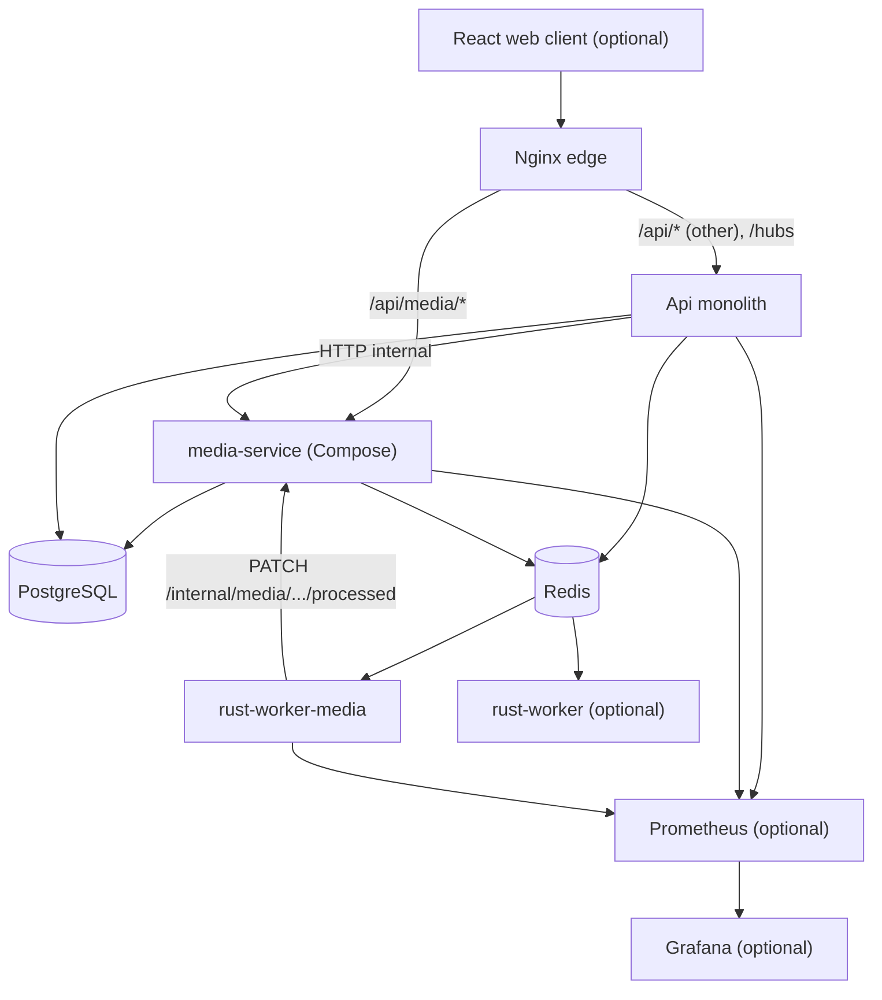
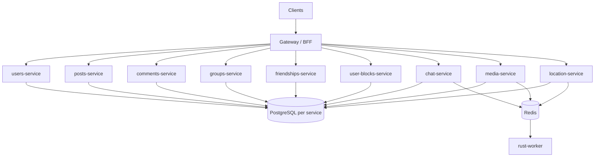

# Architecture

Tangle is a learning project that simulates a distributed system. Today it runs as a **modular monolith** plus an extracted **media-service** in local Compose (Phase 9 step 1), an optional Rust worker fleet, an optional **React web client** behind an Nginx edge, and an optional **Prometheus / Grafana** monitoring profile. Azure production still runs the monolith for all domains until media is deployed there. The target is **domain-aligned microservices** (Phase 9) behind a gateway or BFF.

Service-layer conventions inside the monolith: [services/Api/AGENTS.md](../services/Api/AGENTS.md).

---

## Current state (as-built)

The monolith (`services/Api`) still owns most domains and the `public` schema. **Media is the first extracted deployable:** `services/Media` runs as a separate Compose service; Nginx routes `/api/media/*` and `/internal/media/*` to it. The monolith calls media over HTTP (`IMediaClient`) for link/batch/delete operations. Monolith media ownership (`Domain/Media/`, `public."MediaAssets"`) has been removed — uploads and asset rows live in the `media` schema only.

PostgreSQL remains one instance (schema-per-service for media). Redis is optional (cache, SignalR backplane, pub/sub, Streams producer).



The web client talks to the API same-origin through Nginx (the API has no CORS): in dev the Vite dev server proxies `/api` and `/hubs` to Nginx; in prod Nginx serves the built SPA and proxies the same paths. See [clients/web/README.md](../clients/web/README.md).

### In-process boundaries

Domains live under `services/Api/Domain/`. Each aggregate service owns one repository; cross-aggregate access goes through peer services, not foreign repositories. Orchestrators coordinate multi-step workflows without repositories.

This is **modular monolith** design — clear boundaries inside one process, one database schema (`AppDbContext`), one deployment unit.

### Async boundary

Cross-process work paths:

```text
media-service (CompleteUpload) → Redis Stream media.uploaded → rust-worker-media → PATCH media-service /internal/media/{id}/processed

Api (ChatMessageService) → Redis Stream chat.message.created → rust-worker → handler → XACK
```

See [QUEUE.md](../services/Api/Global/Queue/QUEUE.md), [services/Media/MEDIA.md](../services/Media/MEDIA.md), and [rust-worker README](../workers/rust-worker/README.md). The chat handler is currently a stub; worker infra (consumer group, retry, DLQ, replay) is implemented.

### Realtime

Chat uses SignalR (`/hubs/chat`) in-process. With Redis enabled, the SignalR backplane allows multiple API replicas. Client delivery is **not** pub/sub or Streams — see [REDIS.md](../services/Api/Global/REDIS.md) and [CHAT.md](../services/Api/Domain/Chat/CHAT.md).

### Observability

Prometheus + Grafana stack under [`infra/`](../infra/) with provisioned alerts, recording rules, and infra exporters.

**Metrics**

| Source | Endpoint | Key metrics |
|--------|----------|-------------|
| API | `GET /metrics` | `http_requests_received_total{code, controller}`, `http_request_duration_seconds`, `aspnetcore_healthcheck_status`, `tangle_workqueue_enqueue_total`, `tangle_workqueue_enqueue_failed_total` |
| Media | `GET /metrics` | Same ASP.NET Prometheus middleware as API |
| Workers | `GET /metrics` on `WORKER_METRICS_PORT` | `tangle_worker_jobs_processed_total`, `tangle_worker_pending_messages`, `tangle_worker_dlq_length`, `tangle_worker_callback_requests_total` |
| Postgres / Redis | sidecar exporters | `pg_stat_activity_count`, `redis_memory_used_bytes`, etc. |

**Health** — `GET /health` returns plain-text `Healthy` / `Unhealthy` for PostgreSQL and Redis. Compose healthcheck and Grafana `ApiDependencyUnhealthy` alert use this signal; per-check gauges are on `/metrics`.

**Metrics scrape auth** — Docker enables `Metrics:RequireScrapeSecret` with `X-Metrics-Secret`; Prometheus scrape config sends the header. Local dev keeps `/metrics` open.

**Alerts** — Grafana provisioned rules (folder: Tangle) for HTTP 4xx/5xx, latency p95 SLO, scrape health, worker DLQ/backlog, and infra limits. UI-only (no Alertmanager). Runbook: [infra/README.md#alerting](../infra/README.md#alerting).

**Tracing and logs** — not implemented. Planned later via Grafana Alloy + Loki + Tempo.

Start with `docker compose --profile monitoring up` (add `--profile workers` for worker scrape targets). Details: [infra/README.md](../infra/README.md).

### Docker Compose (default)

| Service | Role |
|---------|------|
| `api` | Monolith (non-media domains; `HttpMediaClient` to media in Docker) |
| `media` | Media microservice (`/api/media/*`, `media` schema) |
| `db` | PostgreSQL |
| `redis` | Cache, backplane, pub/sub, Streams |
| `nginx` | Edge proxy + SPA; strangler routes media to `media` |
| `azurite` | Default — local Azure Blob storage (media uploads) |
| `rust-worker-media` | Optional (`--profile workers`, `harness`) — `media.uploaded` |
| `rust-worker` | Optional (`--profile workers`) — chat/location |
| `prometheus` | Optional (`--profile monitoring`) |
| `grafana` | Optional (`--profile monitoring`) |
| `postgres-exporter` | Optional (`--profile monitoring`) |
| `redis-exporter` | Optional (`--profile monitoring`) |

---

## Target state (MSA)

After Phase 9, the monolith decomposes into domain-aligned microservices behind a **gateway or BFF**. The gateway handles routing, JWT validation, and response composition — not domain business logic.



Service mapping detail: [SERVICE_BOUNDARIES.md](SERVICE_BOUNDARIES.md). Extraction plan: [MSA_MIGRATION.md](MSA_MIGRATION.md).

### Database strategy

**End goal:** database-per-service (each service owns its schema and migrations).

**Interim option (learning project):** shared PostgreSQL instance with **schema-per-service** before splitting physical databases. Avoid cross-schema FKs; use IDs and service calls/events instead.

### Rust worker

The worker stays a **separate process**, not a microservice per handler. Handlers grow by domain (`media.*`, `location.cluster`, etc.). Extract to a dedicated service only if CPU isolation or independent scaling demands it.

---

## Communication patterns

| Pattern | Use when | Today | Target |
|---------|----------|-------|--------|
| In-process service call | Same deployable, strong consistency | `PostService` → `UserService` | Replaced by HTTP/gRPC client |
| Sync HTTP / gRPC | Cross-service reads, auth checks, enrichment | Api → media (`IMediaClient`, `IMonolithAccessClient`) | Primary sync boundary |
| Redis pub/sub | Fire-and-forget domain events | `IEventPublisher` | Cross-service notifications |
| Redis Streams | Durable async work | `IWorkQueue` → rust-worker | Same; may add Kafka later |
| SignalR | Client push (chat, location) | In-process hub | Owned by chat / location services |

Do **not** use Streams as the client realtime channel. SignalR (or WebSocket) delivers live updates; Streams handle background processing.

---

## Monorepo layout

```
/services
  /Api          ← monolith; media code shrinks during Phase 9
  /Media        ← first extracted service (Compose)
/clients/web    ← React client (Phase 6–7: includes Memory Map at /map); MAUI optional later
/workers
  /crates/worker-core, worker-media  ← media worker binary
  /rust-worker  ← chat + location worker
/libs           ← planned shared contracts
/tools          ← planned Go CLI / load testing
/infra          ← Prometheus / Grafana, Nginx edge ([infra/README.md](../infra/README.md))
  /nginx        ← edge reverse proxy (local: media strangler; prod: monolith-only until Azure cutover)
/docs           ← architecture and migration docs (this folder)
```

Solution file (`Tangle.slnx`) includes `Api`, `Api.Tests`, and `Media`. Workers and infra are folders outside the .NET solution.

---

## What is not MSA today

- README diagram label "Gateway" is **aspirational** — Nginx is the Compose edge; there is no dedicated gateway service yet.
- **Azure production** still serves all `/api/*` from the monolith (`nginx.production.conf` has no media upstream yet).
- Monolith media code and `public."MediaAssets"` have been removed; media data lives in the `media` schema.
- No distributed tracing or log aggregation (Grafana Alloy + Loki + Tempo planned in Future Considerations).
- No service mesh.

Phase 9 step 1 (media) is **done in local Compose**; remaining extractions and Azure CD for media follow [MSA_MIGRATION.md](MSA_MIGRATION.md). See [README.md](../README.md#development-phases).
