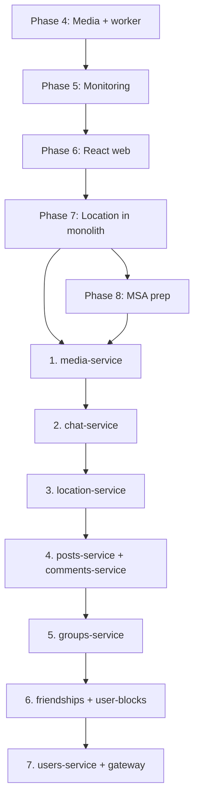

# MSA migration

When and how to decompose the Api monolith into domain-aligned microservices.

**Prerequisites:** complete Phases 5–7 first. **Do not start extraction until monitoring is in place and location is proven end-to-end in the monolith with the React map client.**

Related: [ARCHITECTURE.md](ARCHITECTURE.md), [SERVICE_BOUNDARIES.md](SERVICE_BOUNDARIES.md).

---

## Prerequisites

| Phase | Requirement | Why it blocks MSA if skipped |
|-------|-------------|------------------------------|
| **4** | Rust worker production-ready (retry, DLQ, replay); media on post/comment/chat | Establishes async boundaries and object-storage patterns the media service will own — **Done** |
| **5** | Thin Prometheus + Grafana | Cross-service latency, error rates, and queue depth are invisible without metrics; location TTL/SignalR debugging needs this too |
| **6** | React web client with map UI for location | Proves deploy-and-run E2E; regression target for strangler routing during extraction |
| **7** | Memory Map, location sharing, clustering worker job **in the monolith** | Validates Redis TTL + geo patterns before split; wrong to greenfield `location-service` before monolith proof |

Phase 8 (**MSA prep**) runs during Phase 7: apply [MSA-prep rules](SERVICE_BOUNDARIES.md#msa-prep-rules), document new job types in [QUEUE.md](../services/Api/Global/Queue/QUEUE.md).

Phase 6 starts with an auth scaffold; the map UI completes after Phase 7 location APIs land.

---

## Extraction order

Lowest risk first — services with existing async or realtime boundaries leave the monolith earliest; highly coupled domains and identity leave last.



### Rationale

| Step | Service(s) | Reason |
|------|------------|--------|
| 1 | **media** | Already async via Streams + rust-worker; object storage is a natural isolation boundary |
| 2 | **chat** | SignalR + Streams already define external interfaces; minimal FK surface to other domains |
| 3 | **location** | Redis-heavy, distinct access patterns, separate scaling profile |
| 4 | **posts + comments** | Extract together or back-to-back; tight coupling but well-defined peer-service pattern today |
| 5 | **groups** | Orchestrators, board-post cross-route, PlatformGroup chat links — needs contracts from steps 2 and 4 |
| 6 | **friendships + user-blocks** | Small; low blast radius; still depend on users for identity |
| 7 | **users + gateway** | Everything depends on auth; gateway becomes the sole entry point; monolith code is gone |

Posts and comments may ship as one **community-service** in a first pass if two deployables feel heavy for a learning project. Default plan: **separate** services aligned with folders.

---

## Per-extraction checklist

Copy this checklist for each service extraction. Replace `{service}` with the target name.

### 1. Define the service contract

- [ ] OpenAPI spec for REST surface (routes, DTOs, error codes)
- [ ] List inbound dependencies (which services call `{service}`)
- [ ] List outbound dependencies (which services `{service}` calls)
- [ ] Document async contracts (Streams job types, pub/sub events) in [QUEUE.md](../services/Api/Global/Queue/QUEUE.md)

### 2. Isolate data

- [ ] Move `DbSet` entities and EF migrations to `{service}` schema or database
- [ ] Remove cross-schema FKs; retain IDs only
- [ ] Seed/migration strategy for dev Compose

### 3. Replace in-process calls

- [ ] Map each `*Service` injection to an HTTP/gRPC client interface
- [ ] Add resilience (timeouts, retries on idempotent reads)
- [ ] Replace `Lazy<T>` circular deps with events or gateway orchestration where needed

### 4. Deploy independently

- [ ] New project under `services/{service}/` (or split from Api)
- [ ] Dockerfile and `docker-compose.yml` service entry
- [ ] Health check endpoint (`/health`)
- [ ] Environment config (connection strings, Redis, JWT validation keys)

### 5. Strangler routing

- [ ] Gateway (or slimmed Api) routes `/api/{resource}` to `{service}` for extracted routes
- [ ] Unextracted routes still hit monolith until step 7
- [ ] Verify Swagger/OpenAPI reflects routed surface

### 6. Test the boundary

- [ ] Contract tests: consumer-driven tests against `{service}` OpenAPI
- [ ] Integration tests: Testcontainers for `{service}` DB + dependencies
- [ ] E2E smoke through gateway in Compose

### 7. Observability

- [ ] Service-specific metrics (request latency, error rate)
- [ ] Trace propagation (OpenTelemetry — when added)
- [ ] Dashboards in Grafana for the new service

---

## Strangler fig pattern

During Phase 9 the monolith shrinks incrementally:

```text
Clients → Gateway
            ├─ /api/media/*     → media-service     (extracted)
            ├─ /api/chat/*      → chat-service      (extracted)
            ├─ /api/posts/*     → monolith          (not yet)
            └─ /api/users/*     → monolith          (not yet)
```

The gateway validates JWT once and forwards identity claims. Avoid duplicating business rules in the gateway — compose responses only when needed (e.g. board post create).

---

## Interim database options

| Stage | Setup | Trade-off |
|-------|-------|-----------|
| **A** | Shared Postgres, shared schema (today) | Simplest; no split possible without migration |
| **B** | Shared Postgres, schema per service | Logical isolation; one instance to operate |
| **C** | Database per service | Full isolation; more Compose services and backup complexity |

Recommend **B → C**: move to schema-per-service during first extraction, then separate databases when comfortable.

---

## Non-goals (v1 MSA)

Keep scope realistic for a learning project:

| Non-goal | Notes |
|----------|-------|
| Service mesh (Istio, Linkerd) | Document as future; Compose + gateway is enough |
| Kafka | Stay on Redis Streams unless scale demands; see README Future Considerations |
| Full event sourcing | Streams + pub/sub sufficient |
| Multi-region deployment | Out of scope |
| Zero-downtime blue/green per service | Nice-to-have later |

---

## After migration

When step 7 completes:

- `services/Api` is replaced by `services/gateway` (or equivalent BFF)
- Each domain has its own deployable under `services/`
- [ARCHITECTURE.md](ARCHITECTURE.md) target diagram matches Compose
- Monorepo layout unchanged — only deployable units multiply

Update [docs/README.md](README.md) phase statuses as each extraction lands.
