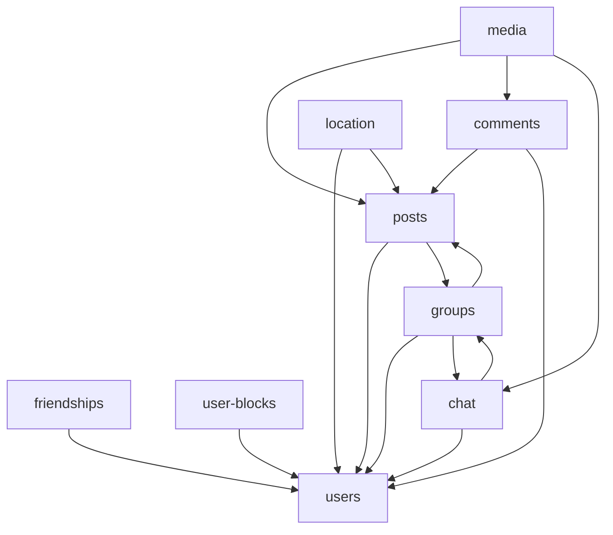

# Service boundaries

Future microservice boundaries align with existing `services/Api/Domain/` folders. Each row below is one target deployable unless noted.

Overview: [ARCHITECTURE.md](ARCHITECTURE.md). Migration order: [MSA_MIGRATION.md](MSA_MIGRATION.md).

---

## Domain → service map

| Service | Source folder | Owned aggregates | API routes (today) | Status |
|---------|---------------|------------------|-------------------|--------|
| **users** | `Domain/Users/` | `User`, JWT auth | `api/users`, `api` (login) | Implemented |
| **posts** | `Domain/Posts/` | `Post` | `api/posts` | Implemented |
| **comments** | `Domain/Comments/` | `Comment` | `api/comments` | Implemented |
| **groups** | `Domain/Groups/` | Group, Board, Member, Invitation, Application, Blacklist | `api/groups/*`, `api/groups/{id}/boards/{id}/posts` | Implemented |
| **friendships** | `Domain/Friendships/` | Friendship, FriendRequest | `api/friendships`, `api/friend-requests` | Implemented |
| **user-blocks** | `Domain/UserBlocks/` | UserBlock | `api/users/blocks` | Implemented |
| **chat** | [`services/Chat/`](../services/Chat/) | ChatRoom, ChatMessage, Participant | `api/chat/*`, `api/groups/{id}/chat-rooms/*`, SignalR `/hubs/chat` | **Extracted (Compose)** — [CHAT.md](../services/Chat/CHAT.md); Azure CD pending |
| **media** | [`services/Media/`](../services/Media/) | MediaAsset, processing state | `api/media`, internal processed callback | **Extracted (Compose)** — [MEDIA.md](../services/Media/MEDIA.md); Azure CD pending |
| **location** | `Domain/Location/` | `MapPin`, `LocationSession` | `api/location/*`, SignalR `/hubs/location` | Implemented — [LOCATION.md](../services/Api/Domain/Location/LOCATION.md) |

---

## Per-service detail

### users-service

**Owns:** user profiles, authentication (login/JWT), nickname cache reads.

**Read by:** every other service for author display names, privacy settings, block checks.

**Notes:**
- `LoginService` stays with this service.
- `NicknameCacheService` may remain a local cache fed by user events or sync GET.

### posts-service

**Owns:** `Post` (title, content, author reference, optional group/board IDs).

**Depends on:**
- **users** — author nickname enrichment, user existence
- **groups** — board context for group-board posts (`GroupId`, `GroupBoardId` on Post)

**Cross-route today:** group-board posts are created via `GroupBoardPostController` under Groups routes but the aggregate is `Post` ([AGENTS.md](../services/Api/AGENTS.md)). **Phase 9 default:** BFF / gateway compose — gateway calls groups for access check, then posts for CRUD. Full contract: [GROUPS.md](../services/Api/Domain/Groups/GROUPS.md).

### comments-service

**Owns:** `Comment` (content, `PostId`, nested `ParentId`, detach fields).

**Depends on:**
- **posts** — post existence, group-board visibility context (`PostService.TryGetGroupBoardContextAsync`)
- **users** — author identity

**Coupling today:** `CommentService` → `PostService`; `PostService` → `Lazy<CommentService>` for delete/detach. At split, replace with HTTP calls or `post.deleted` events plus local comment cleanup jobs.

### groups-service

**Owns:** groups, boards, memberships, invitations, applications, blacklist.

**Depends on:**
- **users** — member identity, inviter/invitee
- **posts** — board posts (see [GROUPS.md](../services/Api/Domain/Groups/GROUPS.md))
- **chat** — `PlatformGroup` chat rooms link a `ChatRoom` to a `Group` (see [GROUPS.md](../services/Api/Domain/Groups/GROUPS.md))

**Orchestrators:** `GroupJoinResolutionService`, `GroupJoinService` — keep workflow logic inside this service at extraction; do not scatter across posts/chat.

### friendships-service

**Owns:** `Friendship`, `FriendRequest`.

**Depends on:** **users** — both parties must exist.

**Optional merge:** small surface area; could merge into **users** or a future **social-graph** service. Default plan: **domain-aligned** separate service.

### user-blocks-service

**Owns:** `UserBlock`.

**Depends on:** **users**.

**Optional merge:** same as friendships — separate by default, merge later if operational overhead outweighs boundary clarity.

### chat-service

**Extracted in local Compose (MSA step 2).** API reference: [CHAT.md](../services/Chat/CHAT.md).

**Owns:** chat rooms, messages, participants, SignalR hub in Postgres `chat` schema.

**Depends on:**
- **users** — participants, sender identity (via `IMonolithAccessClient`)
- **groups** — `PlatformGroup` room type ties to a group ID — cross-service contract: [GROUPS.md](../services/Api/Domain/Groups/GROUPS.md)
- **media** — chat message attachments (via `IMediaClient`)

**Async:** enqueues `chat.message.created` to Redis Streams after persist; `rust-worker-chat` callbacks to chat-service.

**Realtime:** SignalR `/hubs/chat` — Redis backplane for multi-replica scale-out.

**Monolith boundary:** user deletion calls `IChatClient.DetachOnDeletionAsync`; media links via `IChatAccessClient`.

Hub contract: [CHAT.md](../services/Chat/CHAT.md).

### media-service

**Extracted in local Compose (MSA step 1).** API reference: [MEDIA.md](../services/Media/MEDIA.md).

**Owns:** `MediaAsset` in Postgres `media` schema (storage key, mime, dimensions, processing status).

**References (by ID only):** `UploaderId`, `PostId`, `CommentId`, `ChatMessageId` — no cross-schema FKs.

**Inbound:** browser/app via Nginx `/api/media/*`; monolith via `IMediaClient` (`/internal/media/*`); worker callback `PATCH /internal/media/{id}/processed`.

**Outbound:** `IMonolithAccessClient` → Api `/internal/access/*` for user existence and content visibility checks.

**Async flow:**

```text
Client → nginx → media-service (presigned URL) → object storage
              → Stream: media.uploaded → rust-worker-media (transcode)
              → PATCH media-service /internal/media/{id}/processed
              → monolith stores mediaAssetId on post/comment/chat (HttpMediaClient link)
```

**Interim auth:** media-service validates JWT (same secret as monolith) until a gateway owns auth (MSA step 7).

**Worker:** `worker-media` binary; `API_BASE_URL=http://media:8080` in Compose.

**Remaining:** Azure Container App + `nginx.production.conf` strangler; optional data backfill from legacy `public` → `media` schema for existing dev DBs.

### location-service

**Implemented in monolith** (`Domain/Location/`). Extraction target at [MSA step 3](MSA_MIGRATION.md#extraction-order) after Phase 7 E2E proof. See [LOCATION.md](../services/Api/Domain/Location/LOCATION.md).

**Owns:**
- Geo metadata on content (`MapPin`, optional post location) — Postgres
- Live location sessions (`LocationSession` with `groupId`) — Postgres headers + Redis TTL positions
- Safety alerts (stale position monitor, manual SOS) — SignalR `SafetyAlertRaised`

**Depends on:**
- **users** — nicknames, blocks
- **groups** — membership for live sharing and alerts
- **posts** (optional) — location-tagged content for Memory Map

**Realtime:** SignalR `/hubs/location` — `LocationUpdated`, `SafetyAlertRaised`; group-scoped live sharing.

**Async:** `location.cluster` stream → `rust-worker-location` for interim pin clustering (zoom 2–4).

**Web:** React `/map` — MapLibre, pins, clusters, group live overlay, sharing status, SOS.

---

## Cross-cutting dependencies



---

## MSA-prep rules

Apply these during Phase 7 (location in monolith) so later extraction does not require rewrites. Phase 4 (media) already follows these patterns.

1. **No cross-domain repository access** — already enforced in [AGENTS.md](../services/Api/AGENTS.md). Keep it; never add `_db.OtherAggregate` queries.

2. **Reference by ID** — store `userId`, `postId`, `groupId`, `mediaAssetId` across boundaries. No FK joins to another service's tables after split.

3. **Versioned job and event payloads** — Streams in [QUEUE.md](../services/Api/Global/Queue/QUEUE.md); pub/sub in [EVENTS.md](../services/Api/Global/Events/EVENTS.md). Every payload includes `schemaVersion` (currently `1`).

4. **No shared mutable tables for async work** — workers read jobs from Streams and write results back through the owning service's API or a well-defined storage contract, not ad-hoc shared tables.

5. **Explicit contracts before extraction** — Groups ↔ Posts and Groups ↔ Chat documented in [GROUPS.md](../services/Api/Domain/Groups/GROUPS.md) (BFF compose for board posts).

6. **Gateway owns auth context** — JWT validation at the edge; services receive user identity claims, not raw credentials.

---

## Extracted service layout

When code moves from `services/Api/Domain/{Name}/` into `services/{Service}/`, **do not** nest another `Domain/{Name}/` folder — the project *is* the bounded context.

**Monolith (many domains):**

```text
services/Api/
  Domain/Posts/Api/
  Domain/Posts/Service/
  Client/                 → IMediaClient (calls media-service)
  Global/...
```

**Extracted microservice (flat folders, namespaced layers):**

Physical folders sit at the service root — no `Global/` parent directory. **Logical** grouping uses the `{Service}.Global.*` namespace for the copied infra slice (same code that lived under `Api/Global/` during monolith extraction).

```text
services/Media/          → namespace layer decides domain vs global
  Api/                   → Media.Api              (domain)
  Service/               → Media.Service          (domain)
  Repository/            → Media.Repository       (domain)
  Dto/                   → Media.Dto              (domain)
  Entities/              → Media                  (domain)
  Storage/               → Media.Storage          (domain)
  Client/                → Media.Client           (domain)
  Config/                → Media.Config           (domain options, e.g. upload limits)
                         → Media.Global.Config    (platform: Redis, Metrics, Swagger filter)
  Db/                    → Media.Global.Db
  Security/              → Media.Global.Security
  Queue/                 → Media.Global.Queue
  Telemetry/             → Media.Global.Telemetry
  Exceptions/            → Media.Global.Exceptions
  Infrastructure/        → Media.Global.Infrastructure
  Migrations/
  Program.cs
```

| Layer | Folders | Namespace | Examples |
|-------|---------|-----------|----------|
| **Domain** | `Api/`, `Service/`, `Repository/`, `Dto/`, `Entities/`, `Storage/`, `Client/`, `Config/` (domain-only) | `{Service}.*` | `MediaService`, `MediaAsset`, `MediaOptions` |
| **Global infra** | `Db/`, `Security/`, `Queue/`, `Telemetry/`, `Exceptions/`, `Infrastructure/`, `Config/` (platform) | `{Service}.Global.*` | `MediaDbContext`, `JwtBearerValidator`, `RedisOptions`, `GlobalExceptionHandler` |

**Rules:**

1. **Folder ≠ namespace required** — `Config/RedisOptions.cs` can live beside `Config/MediaOptions.cs`; namespace distinguishes platform (`Media.Global.Config`) from domain (`Media.Config`).
2. **Dependency direction** — domain may import global; global **must not** reference domain (`Service/`, `Repository/`, `Entities/`, etc.). Keeps the infra slice copy-pasteable across extractions.
3. **Monolith keeps `Global/` folder** — `Api` has many `Domain/*` siblings, so a physical `Global/` directory still separates cross-cutting code from bounded contexts. Extracted services drop the folder but keep the namespace segment.
4. **Future consolidation** — when duplication hurts, promote the infra slice to a shared NuGet (e.g. `Tangle.ServiceInfrastructure`) and replace `{Service}.Global.*` with package references. Until then, copy-on-extract + namespace convention keeps intent clear.

Future extractions (`services/Chat/`, `services/Location/`, …) follow the same shape with root namespace `Chat.*` / `Chat.Global.*`, etc.

---

## Future consolidation options

Not planned for v1 MSA, but documented for later simplification:

| Merge candidate | Rationale |
|-----------------|-----------|
| friendships + user-blocks → social-graph | Small CRUD surfaces, shared user references |
| friendships + user-blocks → users | Fewer deployables; users service grows |
| posts + comments → community | Tight coupling; single "content" service |

Default remains **domain-aligned** split per folder unless operational cost motivates merge.
