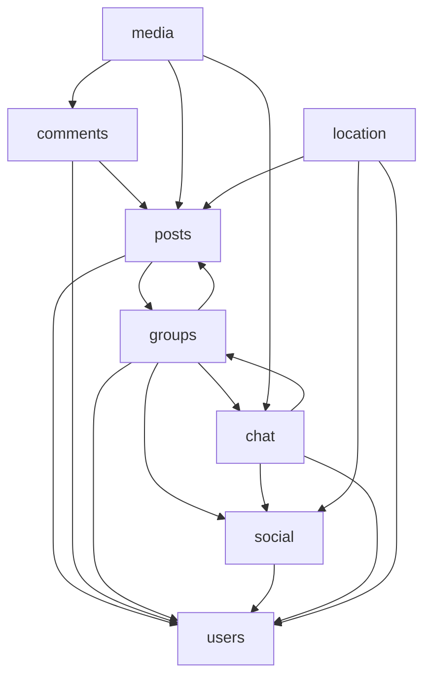

# Service boundaries

Future microservice boundaries align with existing `services/Api/Domain/` folders (now extracted into `services/{Users,Media,...}/`). Each row below is one target deployable unless noted.

Overview: [ARCHITECTURE.md](ARCHITECTURE.md). Migration order: [MSA_MIGRATION.md](MSA_MIGRATION.md).

---

## Domain → service map

| Service | Source folder | Owned aggregates | API routes (today) | Status |
|---------|---------------|------------------|-------------------|--------|
| **gateway** | [`services/Gateway/`](../services/Gateway/) | — (routing + JWT validation) | All `/api/*`, `/hubs/*` via YARP | **Extracted (Compose)** — [GATEWAY.md](../services/Gateway/GATEWAY.md); Azure CD pending |
| **users** | [`services/Users/`](../services/Users/) | `User`, JWT auth | `api/users`, `api/login`, `api/join` | **Extracted (Compose)** — [USERS.md](../services/Users/USERS.md); Azure CD pending |
| **posts** / **comments** | [`services/Community/`](../services/Community/) | Post, Comment | `api/posts`, `api/comments`, group-board posts | **Extracted (Compose)** — [COMMUNITY.md](../services/Community/COMMUNITY.md); Azure CD pending |
| **group** | [`services/Group/`](../services/Group/) | Group, Board, Member, Invitation, Application, Blacklist | `api/groups/*`, invitations, applications | **Extracted (Compose)** — [GROUP.md](../services/Group/GROUP.md); Azure CD pending |
| **social** | [`services/Social/`](../services/Social/) | Friendship, FriendRequest, UserBlock | `api/friendships/*`, `api/users/blocks` | **Extracted (Compose)** — [SOCIAL.md](../services/Social/SOCIAL.md); Azure CD pending |
| **chat** | [`services/Chat/`](../services/Chat/) | ChatRoom, ChatMessage, Participant | `api/chat/*`, `api/groups/{id}/chat-rooms/*`, SignalR `/hubs/chat` | **Extracted (Compose)** — [CHAT.md](../services/Chat/CHAT.md); Azure CD pending |
| **media** | [`services/Media/`](../services/Media/) | MediaAsset, processing state | `api/media`, internal processed callback | **Extracted (Compose)** — [MEDIA.md](../services/Media/MEDIA.md); Azure CD pending |
| **location** | [`services/Location/`](../services/Location/) | `MapPin`, `LocationSession` | `api/location/*`, SignalR `/hubs/location` | **Extracted (Compose)** — [LOCATION.md](../services/Location/LOCATION.md); Azure CD pending |

---

## Per-service detail

### users-service

**Owns:** user profiles, authentication (login/JWT), nickname cache reads.

**Read by:** every other service for author display names, privacy settings, block checks.

**Notes:**
- `LoginService` stays with this service.
- `NicknameCacheService` may remain a local cache fed by user events or sync GET.

### community-service

**Extracted in local Compose (MSA step 4).** API reference: [COMMUNITY.md](../services/Community/COMMUNITY.md).

**Owns:** `Post` and `Comment` in Postgres `community` schema (tight delete/detach and board-visibility coupling).

**Depends on:**
- **users** — author nickname enrichment, user existence (via `IUserClient`)
- **social** — mutual block filtering (via `ISocialClient`)
- **group** — board view/write access (via `IGroupClient` → `/internal/group/*`)
- **media** / **location** — attachments and post geo (HTTP clients)

**Public routes:** `/api/posts`, `/api/comments`, `/api/groups/{id}/boards/{id}/posts`. **Internal:** `/internal/community/*` (media-view, owner, viewable-ids, user/group detach).

### group-service

**Extracted in local Compose (MSA step 5).** API reference: [GROUP.md](../services/Group/GROUP.md).

**Owns:** groups, boards, memberships, invitations, applications, blacklist in Postgres `group` schema.

**Depends on:**
- **users** — member identity, inviter/invitee (via `IUserClient`)
- **social** — block checks (via `ISocialClient`)
- **community** — delete-all posts on group delete (`ICommunityClient`)
- **location** — end sessions on group delete (`ILocationClient`)

**Orchestrators:** `GroupJoinResolutionService`, `GroupJoinService` — workflow logic stays in this service.

**Public routes:** `/api/groups/*`, `/api/invitations/*`, `/api/applications/*`. **Internal:** `/internal/group/*` (membership, board access, user detach).

### social-service

**Extracted in local Compose (MSA step 6).** API reference: [SOCIAL.md](../services/Social/SOCIAL.md).

**Owns:** `Friendship`, `FriendRequest`, and `UserBlock` in Postgres `social` schema (tight block ↔ pending-request coupling via `IgnoredByBlock`).

**Depends on:** **users** — party existence, nicknames, friends-list visibility (via `IUserClient`).

**Public routes:** `/api/friendships/*`, `/api/users/blocks`. **Internal:** `/internal/social/*` (friendship/block checks, user detach).

**Read by:** Chat (DM friendship + blocks), Group (is-blocked-by), Community and Location (mutual blocks), Users-service (user delete detach).

### chat-service

**Extracted in local Compose (MSA step 2).** API reference: [CHAT.md](../services/Chat/CHAT.md).

**Owns:** chat rooms, messages, participants, SignalR hub in Postgres `chat` schema.

**Depends on:**
- **users** — participants, sender identity (via `IUserClient`)
- **group** — `PlatformGroup` room type ties to a group ID (via `IGroupClient`)
- **media** — chat message attachments (via `IMediaClient`)

**Async:** enqueues `chat.message.created` to Redis Streams after persist; `rust-worker-chat` callbacks to chat-service.

**Realtime:** SignalR `/hubs/chat` — Redis backplane for multi-replica scale-out.

**User delete:** Users-service calls `IChatClient.DetachOnDeletionAsync`; media links via `IChatAccessClient`.

Hub contract: [CHAT.md](../services/Chat/CHAT.md).

### media-service

**Extracted in local Compose (MSA step 1).** API reference: [MEDIA.md](../services/Media/MEDIA.md).

**Owns:** `MediaAsset` in Postgres `media` schema (storage key, mime, dimensions, processing status).

**References (by ID only):** `UploaderId`, `PostId`, `CommentId`, `ChatMessageId` — no cross-schema FKs.

**Inbound:** browser/app via nginx → gateway → `/api/media/*`; domain services via `IMediaClient` (`/internal/media/*`); worker callback `PATCH /internal/media/{id}/processed`.

**Outbound:** `IUserClient` → users-service `/internal/users/*` for user existence and content visibility checks.

**Async flow:**

```text
Client → nginx → gateway → media-service (presigned URL) → object storage
              → Stream: media.uploaded → rust-worker-media (transcode)
              → PATCH media-service /internal/media/{id}/processed
              → community/chat attach mediaAssetId via IMediaClient link
```

**Auth:** Gateway validates JWT at the edge; media-service trusts `X-Gateway-Secret` + `X-User-Id` from the gateway.

**Worker:** `worker-media` binary; `API_BASE_URL=http://media:8080` in Compose.

**Remaining:** Azure Container App + `nginx.production.conf` strangler; optional data backfill from legacy `public` → `media` schema for existing dev DBs.

### location-service

**Extracted on develop** ([`services/Location/`](../services/Location/)). See [LOCATION.md](../services/Location/LOCATION.md) and [MSA step 3](MSA_MIGRATION.md#step-3--location-service-develop-done).

**Owns:**
- Geo metadata on content (`MapPin`, optional post location) — Postgres `location` schema
- Live location sessions (`LocationSession` with `groupId`) — Postgres headers + Redis TTL positions
- Safety alerts (stale position monitor, manual SOS) — SignalR `SafetyAlertRaised`
- Google Places proxy (`/api/location/places/*`)

**Depends on:**
- **users** (via `IUserClient`) — existence, nicknames, blocks
- **group** (via `IGroupClient`) — membership for live sharing and alerts
- **community** (via `ICommunityAccessClient`) — post ownership and viewability for post-linked pins

**users-service integration:** `ILocationClient` — post upsert/clear, user detach on deletion, group session end on group delete.

**Realtime:** SignalR `/hubs/location` — `LocationUpdated`, `SafetyAlertRaised`; group-scoped live sharing.

**Async:** `location.cluster` stream → `rust-worker-location` for interim pin clustering (zoom 2–4). Worker `API_BASE_URL=http://location:8080` in Compose.

**Web:** React `/map` — MapLibre, pins, clusters, group live overlay, sharing status, SOS.

**Remaining:** Azure Container App + `nginx.production.conf` strangler; optional data backfill from legacy `public` → `location` schema for existing dev DBs.

---

## Internal service authentication

Service-to-service routes under `/internal/*` (except worker callbacks) use the shared header **`X-Internal-Secret`**. Configure the same value on both sides — e.g. `InternalAccess:Secret` (Chat, Location, Users), `Media:InternalServiceSecret` (Media), and matching client options on callers (`MediaClient:InternalSecret`, `Users:InternalSecret`, `ChatClient:InternalSecret`, `LocationClient:InternalSecret`).

Worker callbacks use separate secrets: `X-Worker-Callback-Secret` on media and location processed routes — see [MEDIA.md](../services/Media/MEDIA.md).

---

## Cross-cutting dependencies



---

## MSA-prep rules

Apply these patterns for any future extractions. Media, chat, location, community, group, social, users, and gateway already follow them.

1. **No cross-domain repository access** — already enforced in [AGENTS.md](../services/Api/AGENTS.md). Keep it; never add `_db.OtherAggregate` queries.

2. **Reference by ID** — store `userId`, `postId`, `groupId`, `mediaAssetId` across boundaries. No FK joins to another service's tables after split.

3. **Versioned job and event payloads** — Streams in [QUEUE.md](../services/Api/Global/Queue/QUEUE.md); pub/sub in [EVENTS.md](../services/Api/Global/Events/EVENTS.md). Every payload includes `schemaVersion` (currently `1`).

4. **No shared mutable tables for async work** — workers read jobs from Streams and write results back through the owning service's API or a well-defined storage contract, not ad-hoc shared tables.

5. **Explicit contracts before extraction** — Group ↔ Community and Group ↔ Chat interim contracts live in [GROUP.md](../services/Group/GROUP.md); gateway YARP routes board posts and group chat rooms to the correct service.

6. **Gateway owns auth context** — JWT validation at the edge; services receive user identity claims, not raw credentials.

---

## Extracted service layout

When code moves from `services/Api/Domain/{Name}/` into `services/{Service}/`, **do not** nest another `Domain/{Name}/` folder — the project *is* the bounded context.

**Monolith (many domains):**

```text
services/Api/
  Domain/Posts/Api/
  Domain/Posts/Service/
  Client/                 → IMediaClient (calls media-service)
  Global/...
```

**Extracted microservice (flat folders, namespaced layers):**

Physical folders sit at the service root — no `Global/` parent directory. **Logical** grouping uses the `{Service}.Global.*` namespace for the copied infra slice (same code that lived under `Api/Global/` during monolith extraction).

```text
services/Media/          → namespace layer decides domain vs global
  Api/                   → Media.Api              (domain)
  Service/               → Media.Service          (domain)
  Repository/            → Media.Repository       (domain)
  Dto/                   → Media.Dto              (domain)
  Entities/              → Media                  (domain)
  Storage/               → Media.Storage          (domain)
  Client/                → Media.Client           (domain)
  Config/                → Media.Config           (domain options, e.g. upload limits)
                         → Media.Global.Config    (platform: Redis, Metrics, Swagger filter)
  Db/                    → Media.Global.Db
  Security/              → Media.Global.Security
  Queue/                 → Media.Global.Queue
  Telemetry/             → Media.Global.Telemetry
  Exceptions/            → Media.Global.Exceptions
  Infrastructure/        → Media.Global.Infrastructure
  Migrations/
  Program.cs
```

| Layer | Folders | Namespace | Examples |
|-------|---------|-----------|----------|
| **Domain** | `Api/`, `Service/`, `Repository/`, `Dto/`, `Entities/`, `Storage/`, `Client/`, `Config/` (domain-only) | `{Service}.*` | `MediaService`, `MediaAsset`, `MediaOptions` |
| **Global infra** | `Db/`, `Security/`, `Queue/`, `Telemetry/`, `Exceptions/`, `Infrastructure/`, `Config/` (platform) | `{Service}.Global.*` | `MediaDbContext`, `JwtBearerValidator`, `RedisOptions`, `GlobalExceptionHandler` |

**Rules:**

1. **Folder ≠ namespace required** — `Config/RedisOptions.cs` can live beside `Config/MediaOptions.cs`; namespace distinguishes platform (`Media.Global.Config`) from domain (`Media.Config`).
2. **Dependency direction** — domain may import global; global **must not** reference domain (`Service/`, `Repository/`, `Entities/`, etc.). Keeps the infra slice copy-pasteable across extractions.
3. **Monolith keeps `Global/` folder** — `Api` has many `Domain/*` siblings, so a physical `Global/` directory still separates cross-cutting code from bounded contexts. Extracted services drop the folder but keep the namespace segment.
4. **Future consolidation** — when duplication hurts, promote the infra slice to a shared NuGet (e.g. `Tangle.ServiceInfrastructure`) and replace `{Service}.Global.*` with package references. Until then, copy-on-extract + namespace convention keeps intent clear.

Future extractions (`services/Chat/`, `services/Location/`, …) follow the same shape with root namespace `Chat.*` / `Chat.Global.*`, etc.

---

## Future consolidation options

Not planned for v1 MSA, but documented for later simplification:

| Merge candidate | Rationale |
|-----------------|-----------|
| social → users | Fewer deployables; users service grows |

Posts + comments already ship as **community-service** (MSA step 4). Friendships + user-blocks ship as **social-service** (MSA step 6). Default remains **domain-aligned** split per folder unless operational cost motivates merge.
